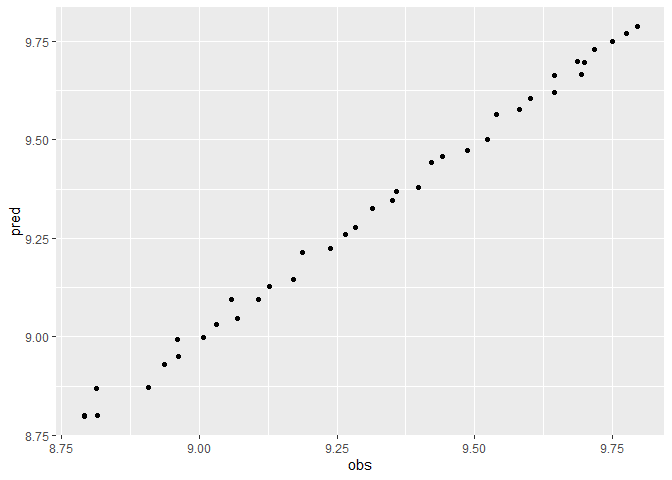

<!-- README.md is generated from README.Rmd. Please edit that file -->

# prorata

<!-- badges: start -->
<!-- badges: end -->

The goal of prorata is to …

## Installation

You can install the development version of prorata from
[GitHub](https://github.com/) with:

``` r
# install.packages("devtools")
devtools::install_github("UchidaMizuki/prorata")
```

## Example

``` r
library(prorata)
library(tidyverse)
```

### Freeny’s Revenue Data

- Quarterly revenues are estimated from prorated values for annual
  revenues based on price index, income level, and market potential
- Estimate weights that sum to 1 with the least squared error (or
  absolute error)
- Input the following `y` and `x` to `prorata()`
  - `y`: Quarterly revenues (observations x categories)
  - `x`: Prorated values for annual revenues (observations x categories
    x clusters)
- Apply `predict()` to `prorata()` output

``` r
data <- freeny |> 
  as_tibble(rownames = "year_quarter") |> 
  separate_wider_delim(year_quarter, 
                       delim = ".",
                       names = c("year", "quarter"),
                       too_few = "align_start") |> 
  replace_na(list(quarter = "0"))

y <- xtabs(y ~ year + quarter,
           data = data)
y
#>       quarter
#> year         0      25       5      75
#>   1962 0.00000 8.79236 8.79137 8.81486
#>   1963 8.81301 8.90751 8.93673 8.96161
#>   1964 8.96044 9.00868 9.03049 9.06906
#>   1965 9.05871 9.10698 9.12685 9.17096
#>   1966 9.18665 9.23823 9.26487 9.28436
#>   1967 9.31378 9.35025 9.35835 9.39767
#>   1968 9.42150 9.44223 9.48721 9.52374
#>   1969 9.53980 9.58123 9.60048 9.64496
#>   1970 9.64390 9.69405 9.69958 9.68683
#>   1971 9.71774 9.74924 9.77536 9.79424

x <- data |> 
  mutate(across(!c(quarter, y),
                \(x) x / sum(x) * sum(y)),
         .by = year,
         .keep = "unused") |> 
  pivot_longer(!c(year, quarter)) |> 
  xtabs(value ~ year + quarter + name,
        data = _)
x
#> , , name = income.level
#> 
#>       quarter
#> year          0       25        5       75
#>   1962 0.000000 8.792230 8.798996 8.807364
#>   1963 8.877617 8.892665 8.914371 8.934207
#>   1964 8.968195 9.010940 9.036153 9.053382
#>   1965 9.067765 9.093396 9.132520 9.169818
#>   1966 9.227892 9.234483 9.251915 9.259820
#>   1967 9.333069 9.348622 9.362712 9.375647
#>   1968 9.451883 9.467497 9.473522 9.481778
#>   1969 9.565992 9.580351 9.605134 9.614993
#>   1970 9.669714 9.679877 9.697076 9.677693
#>   1971 9.745423 9.753888 9.763488 9.773781
#> 
#> , , name = lag.quarterly.revenue
#> 
#>       quarter
#> year          0       25        5       75
#>   1962 0.000000 8.802529 8.798526 8.797535
#>   1963 8.851328 8.849470 8.944361 8.973702
#>   1964 8.988387 8.987213 9.035597 9.057473
#>   1965 9.094475 9.084096 9.132501 9.152427
#>   1966 9.199174 9.214912 9.266651 9.293373
#>   1967 9.312559 9.342068 9.378649 9.386774
#>   1968 9.429056 9.452965 9.473764 9.518895
#>   1969 9.553926 9.570037 9.611598 9.630909
#>   1970 9.655400 9.654339 9.704543 9.710079
#>   1971 9.713557 9.744552 9.776139 9.802331
#> 
#> , , name = market.potential
#> 
#>       quarter
#> year          0       25        5       75
#>   1962 0.000000 8.797066 8.799372 8.802153
#>   1963 8.901852 8.903566 8.905144 8.908298
#>   1964 9.012053 9.015451 9.018295 9.022872
#>   1965 9.109733 9.113443 9.117152 9.123171
#>   1966 9.236534 9.241350 9.245174 9.251052
#>   1967 9.350058 9.353206 9.355567 9.361219
#>   1968 9.463809 9.466122 9.468580 9.476170
#>   1969 9.585461 9.589334 9.592549 9.599126
#>   1970 9.677813 9.679949 9.681053 9.685545
#>   1971 9.757495 9.756457 9.759868 9.762760
#> 
#> , , name = price.index
#> 
#>       quarter
#> year          0       25        5       75
#>   1962 0.000000 8.817208 8.802606 8.778775
#>   1963 8.986761 8.899704 8.871587 8.860808
#>   1964 9.029695 9.024864 9.012327 9.001784
#>   1965 9.128953 9.101743 9.123006 9.109798
#>   1966 9.276811 9.255058 9.230749 9.211492
#>   1967 9.390601 9.376734 9.356080 9.296636
#>   1968 9.509928 9.489451 9.447964 9.427337
#>   1969 9.634258 9.604972 9.576647 9.550593
#>   1970 9.706148 9.689394 9.664409 9.664409
#>   1971 9.795553 9.774508 9.733829 9.732691

fitted <- prorata(y, x,
                  type = "squared")
fitted
#> [1] 1.238855e-01 5.800275e-01 2.960870e-01 5.620486e-10
#> attr(,"class")
#> [1] "prorata"

pred <- predict(fitted,
                new_data = x)
pred
#>       quarter
#> year          0       25        5       75
#>   1962 0.000000 8.799635 8.798835 8.800120
#>   1963 8.869544 8.870838 8.929034 8.949444
#>   1964 8.992892 8.998514 9.030543 9.046721
#>   1965 9.095684 9.093938 9.127959 9.145919
#>   1966 9.213794 9.225165 9.258466 9.276685
#>   1967 9.326203 9.346178 9.369840 9.377829
#>   1968 9.442174 9.458661 9.472199 9.501646
#>   1969 9.564758 9.577028 9.605157 9.619527
#>   1970 9.663809 9.665085 9.696663 9.698803
#>   1971 9.730514 9.749234 9.769754 9.787078

tibble(obs = as.double(y),
       pred = as.double(pred)) |>
  filter(obs > 0) |>
  ggplot(aes(obs, pred)) +
  geom_point()
```


